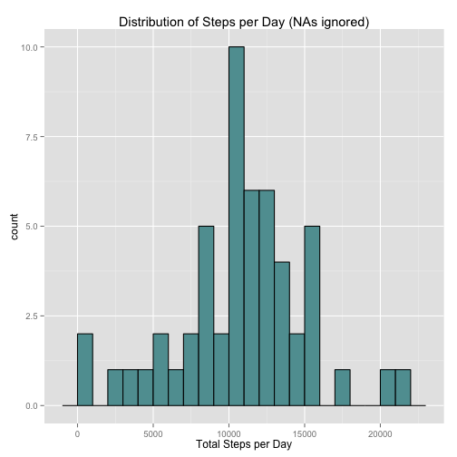
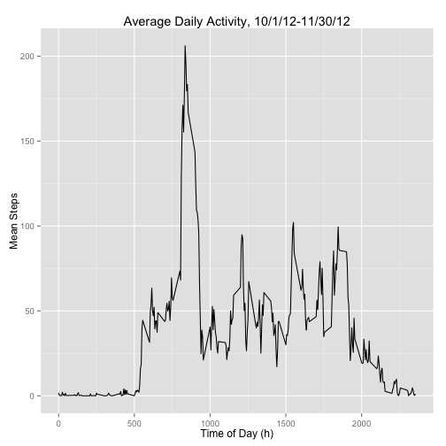
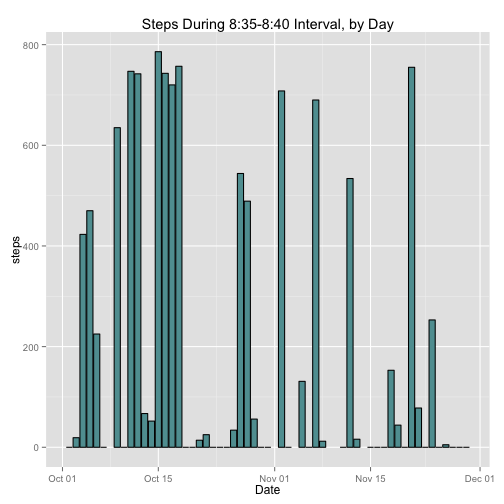
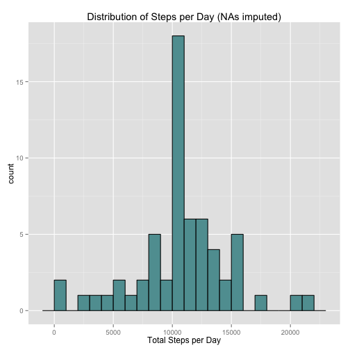
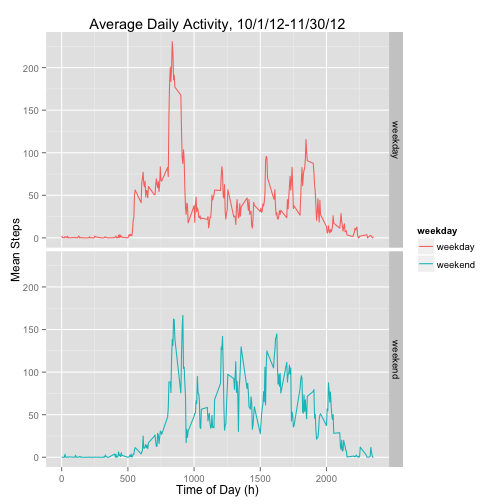

Reproducible Research Assignment 1
============================================================

### Introduction

In this assignment, we will perform an exploratory analysis on a dataset 
containing personal movement data, specifically the of amount of steps taken per 
day. [fitbit](http://www.fitbit.com) is an example of the type of device that 
was used to collect the data.

### Loading and preprocessing the data

Let's get started by loading a couple useful packages, unzipping the data, 
reading it into R, and taking a quick look at its structure.


```r
library(plyr)
library(ggplot2)
knitr::opts_chunk$set(fig.path='figures/') #for some reason I couldn't figure
#out why my figures weren't being saved in their own subdirectory by default
#but I found this useful snippet for setting global chunk options on
#http://kbroman.org/knitr_knutshell/pages/Rmarkdown.html

unzip("activity.zip")
activity <- read.csv("activity.csv")
str(activity)
```

```
## 'data.frame':	17568 obs. of  3 variables:
##  $ steps   : int  NA NA NA NA NA NA NA NA NA NA ...
##  $ date    : Factor w/ 61 levels "2012-10-01","2012-10-02",..: 1 1 1 1 1 1 1 1 1 1 ...
##  $ interval: int  0 5 10 15 20 25 30 35 40 45 ...
```

Since the date column is of class Factor, let's coerce it to a Date class.


```r
activity$date <- as.Date(activity$date)
```

It is also apparent from the str output that the steps column contains some
missing values, which will be covered later.


### What is mean total number of steps taken per day?

The first step in addressing this question is making an aggregate data table
with the total number of steps per day, and look at the distribution of
steps per day by plotting a histogram. For this first pass, NAs will be 
ignored.


```r
daily_steps <- ddply(activity, .(date), summarize, 
                     total_steps = sum(steps))
g <- ggplot(daily_steps, aes(x=total_steps)) 
g + geom_histogram(fill = "cadetblue", color = "black", binwidth = 1000) + 
    xlab("Total Steps per Day") + 
    ggtitle("Distribution of Steps per Day (NAs ignored)")
```

 

The steps per day look to be very roughly normally distributed.  Let's also 
generate some corresponding summary statistics.


```r
summary(daily_steps$total_steps)
```

```
##    Min. 1st Qu.  Median    Mean 3rd Qu.    Max.    NA's 
##      41    8841   10760   10770   13290   21190       8
```


### What is the average daily activity pattern?

In order to get an understanding of activity throughout the day, steps will
be grouped by 5 minute interval and averaged across all 61 days in the set.
The aggregate data is plotted below as a time series.  Note that NAs are again
ignored.


```r
intervals <- ddply(activity, .(interval), summarize, 
                   mean_steps = mean(steps, na.rm = TRUE))
g <- ggplot(intervals, aes(x=interval, y=mean_steps))
g + geom_line() + xlab("Time of Day (h)") + ylab("Mean Steps") +
    ggtitle("Average Daily Activity, 10/1/12-11/30/12")
```

 

The data show that the subject of the analysis typically wakes up at 5 am and 
goes to bed around 11 pm.  There is a clear peak in activity in the morning.  Subsetting the intervals data makes it easy to pinpoint the time of peak activity.


```r
subset(intervals, mean_steps==max(mean_steps))
```

```
##     interval mean_steps
## 104      835   206.1698
```

It appears that this person likes to exercise around 8:30 am. Taking a look at 
steps during just the 8:35 interval for each day could give more information 
about the morning exercise pattern.


```r
peak <- subset(activity, interval == 835 & !is.na(steps))
g <- ggplot(peak, aes(x=date, y=steps))
g + geom_bar(stat = "identity", fill = "cadetblue", color = "black") + 
    xlab("Date") + ggtitle("Steps During 8:35-8:40 Interval, by Day")
```

 

This data suggests that the subject was most motivated to exercise in the first
half of October.  Further, some inference about the nature of the exercise can
be made by calculating cadence (steps/min).  The exercise appears to be a mix
of walking and running.  The step counts 700-800 equate to a cadence of 140-180,
which would be associated with running, while step counts of 500 (cadence <= 100)     or lower would be more representative of walking.  Of course this assumes that the steps were accurately counted, and that the subject was in the midst of the workout during this 5 minute interval.  This [Wikipedia article](http://en.wikipedia.org/wiki/Running#Elements_of_good_running_technique) gives some further information about 
running cadence.


### Imputing missing values

As mentioned earlier, there are several missing observations in the steps data.


```r
sum(is.na(activity$steps))
```

```
## [1] 2304
```

```r
mean(is.na(activity$steps))
```

```
## [1] 0.1311475
```

The sum and the mean of the missing values show that 2304 observations are 
missing, which is about 13% of the total observations.  The first logical step
in coming up with a resonable scheme for imputing the missing values is taking 
a look at where the NAs occur.


```r
missing <- ddply(activity, .(date), summarize, NAs = sum(is.na(steps)))
missing
```

```
##          date NAs
## 1  2012-10-01 288
## 2  2012-10-02   0
## 3  2012-10-03   0
## 4  2012-10-04   0
## 5  2012-10-05   0
## 6  2012-10-06   0
## 7  2012-10-07   0
## 8  2012-10-08 288
## 9  2012-10-09   0
## 10 2012-10-10   0
## 11 2012-10-11   0
## 12 2012-10-12   0
## 13 2012-10-13   0
## 14 2012-10-14   0
## 15 2012-10-15   0
## 16 2012-10-16   0
## 17 2012-10-17   0
## 18 2012-10-18   0
## 19 2012-10-19   0
## 20 2012-10-20   0
## 21 2012-10-21   0
## 22 2012-10-22   0
## 23 2012-10-23   0
## 24 2012-10-24   0
## 25 2012-10-25   0
## 26 2012-10-26   0
## 27 2012-10-27   0
## 28 2012-10-28   0
## 29 2012-10-29   0
## 30 2012-10-30   0
## 31 2012-10-31   0
## 32 2012-11-01 288
## 33 2012-11-02   0
## 34 2012-11-03   0
## 35 2012-11-04 288
## 36 2012-11-05   0
## 37 2012-11-06   0
## 38 2012-11-07   0
## 39 2012-11-08   0
## 40 2012-11-09 288
## 41 2012-11-10 288
## 42 2012-11-11   0
## 43 2012-11-12   0
## 44 2012-11-13   0
## 45 2012-11-14 288
## 46 2012-11-15   0
## 47 2012-11-16   0
## 48 2012-11-17   0
## 49 2012-11-18   0
## 50 2012-11-19   0
## 51 2012-11-20   0
## 52 2012-11-21   0
## 53 2012-11-22   0
## 54 2012-11-23   0
## 55 2012-11-24   0
## 56 2012-11-25   0
## 57 2012-11-26   0
## 58 2012-11-27   0
## 59 2012-11-28   0
## 60 2012-11-29   0
## 61 2012-11-30 288
```

The missing table clearly shows that the NAs can be attributed to 8 days 
for which there was no data recorded.  Presumably the subject forgot to put on
the step tracking device on those days.  Since the missing days are more or less 
evenly distributed in time rather than clustered together, it makes sense to 
populate each missing day with the grand mean steps per 5 minute interval.


```r
#pull a vector of dates with missing values
NAdates <- missing[missing$NAs > 0, 1]
NAdates
```

```
## [1] "2012-10-01" "2012-10-08" "2012-11-01" "2012-11-04" "2012-11-09"
## [6] "2012-11-10" "2012-11-14" "2012-11-30"
```

```r
#set each 5 minute interval for the missing days to the corresponding mean steps
for(i in 1:length(NAdates)){
    activity[activity$date == NAdates[i], 1] <- intervals$mean_steps
}

#aggregate total steps per day with imputed data and plot histogram
daily_steps <- ddply(activity, .(date), summarize, 
                     total_steps = sum(steps))

g <- ggplot(daily_steps, aes(x=total_steps)) 
g + geom_histogram(fill = "cadetblue", color = "black", binwidth = 1000) + 
    xlab("Total Steps per Day") + 
    ggtitle("Distribution of Steps per Day (NAs imputed)")
```

 

```r
summary(daily_steps$total_steps)
```

```
##    Min. 1st Qu.  Median    Mean 3rd Qu.    Max. 
##      41    9819   10770   10770   12810   21190
```

We can see the effects of the imputed data in the histogram and summary statisics.  The histogram shows higher frequency in the center fo the daata.  The min, max, and mean are unchanged, as would be expected, however, the imputed data slightly raise the median, raise the 1st quartile and lower the 3rd quartile.  This makes sense since data was added at the center of the sample distribution.

### Are there differences in activity patterns between weekdays and weekends?

In order to visualize the daily activity patterns split by weekdays and weekends,
a new column, weekday, will be added for use as a grouping factor.  The step
data will then be aggregated by 5 minute interval and weekday/weekend.


```r
activity <- transform(activity, 
                weekday = ifelse(weekdays(date) == "Sunday" | 
                    weekdays(date) == "Saturday", "weekend", "weekday"))

intervals <- ddply(activity, .(interval, weekday), summarize, 
                   mean_steps = mean(steps))

g <- ggplot(intervals, aes(x=interval, y=mean_steps))
g + geom_line(aes(color = weekday)) + facet_grid(weekday~.) + 
    ylab("Mean Steps") + xlab("Time of Day (h)") +
    ggtitle("Average Daily Activity, 10/1/12-11/30/12")
```

 

We can see a few clear differences in the subject's activity patterns. On 
weekends, (s)he doesn't perform the typical morning exercise we observed 
earlier, but is generally more active throughout the day.  (S)he also tends 
to sleep in, and stay up a bit later at night.
